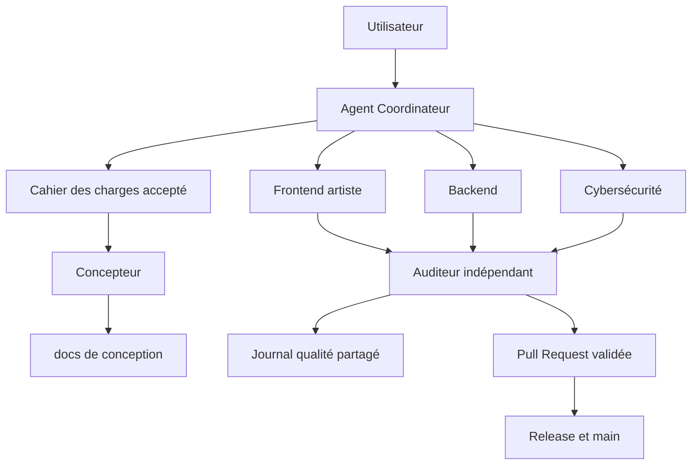

# Agentic Starter Kits

[](VERSION)

## Construire avec une IA comme avec une équipe senior

Agentic Starter Kits est une base portable de gouvernance, de conception, d’orchestration et de contrôle qualité pour construire des projets logiciels avec un agent IA. Le dépôt transforme une conversation en processus de livraison traçable, depuis le cahier des charges jusqu’à la Pull Request et à la maintenance.

Le kit ne fournit pas une simple collection de prompts. Il fournit une méthode de travail complète : règles, agents spécialisés, Skills réutilisables, configuration technologique, documents de conception, journal qualité, contrôles de sécurité, GitFlow, CI et optimisation continue du coût.

## Démarrage rapide

Vous n’avez pas besoin de déplacer manuellement les dossiers du dépôt. L’installateur choisit une seule variante, la copie au bon emplacement et installe le workflow de mises à jour.

### 1. Télécharger le kit

```bash
git clone https://github.com/krapaud/AGENTIC-Starter-Kits.git
cd AGENTIC-Starter-Kits
```

### 2. Installer Codex ou Claude

Pour Codex :

```bash
./install.sh --kit codex --target /chemin/vers/mon-projet
```

Pour Claude :

```bash
./install.sh --kit claude --target /chemin/vers/mon-projet
```

Pour choisir le mode dans l’assistant interactif, lancez simplement :

```bash
./install.sh
```

Pour le mode externe :

```bash
./install.sh --kit codex --mode external --target /chemin/vers/mon-projet
```

Le chemin cible doit déjà exister. N’installez jamais les deux orchestrateurs dans le même projet. Le mode natif est recommandé si vous débutez. Le mode externe est recommandé si vous ne voulez pas publier le contenu du kit dans le dépôt distant.

### 3. Activer les mises à jour

Publiez le projet sur GitHub, ouvrez `Actions`, puis activez les workflows si GitHub le demande. Le workflow installé vérifie les nouvelles versions chaque semaine et ouvre une Pull Request automatique.

### 4. Premier échange avec l’agent

Ouvrez le projet à sa racine dans Codex ou Claude et envoyez le cahier des charges complet. L’agent pose ensuite les questions manquantes, prépare les documents de conception et attend les décisions nécessaires avant de coder.

Le guide détaillé est disponible dans [INSTALLATION.md](INSTALLATION.md).

## Ce que le projet permet de faire

Avec un seul kit importé dans un nouveau dépôt, l’IA peut :

- Refuser de commencer tant qu’un cahier des charges réel n’est pas fourni et accepté.
- Analyser la machine, le dépôt existant, la stack et les commandes disponibles.
- Adapter son comportement aux technologies déclarées dans `project-profile.toml`.
- Produire une conception complète de niveau Concepteur Développeur d’Applications.
- Générer vision, objectifs, user stories, parcours, architecture, données, API, sécurité, roadmap et diagrammes.
- Proposer un Trello complet des tâches, après une réponse explicite de l’utilisateur.
- Répartir le travail entre les six agents du noyau et les dix agents spécialistes optionnels.
- Construire des interfaces premium avec direction artistique, design system, motion design et validation visuelle.
- Rechercher ou générer des médias réalistes avec provenance, licence et retouches documentées.
- Développer le frontend, le backend, les tests et la documentation par petits changements.
- Enregistrer bugs, vulnérabilités, défauts visuels et corrections dans un journal partagé.
- Auditer indépendamment chaque livraison avant sa clôture.
- Bloquer un push si les contrôles, tests, audits ou documents requis échouent.
- Livrer avec des branches, commits atomiques, Pull Requests et versionnement SemVer.
- Mesurer et améliorer progressivement la qualité, la performance et le coût d’utilisation des agents.

## Architecture générale



## Les deux kits disponibles

| Kit | Fichier racine | Dossier | Orchestrateur | Usage |
| --- | --- | --- | --- | --- |
| Codex | `AGENTS.md` | `.codex/` | Codex | Kit natif pour une orchestration avec Codex |
| Claude Code | `CLAUDE.md` | `.claude/` | Claude Code | Kit natif avec agents et Skills Claude |

Choisir un seul kit par projet. Les deux kits sont fonctionnellement alignés, mais leurs formats suivent leur outil respectif.

## Les six agents du noyau

### Coordinateur

Il est le chef d’orchestre. Il contrôle le périmètre, les dépendances, le découpage, les priorités, les budgets de raisonnement, les preuves attendues et la clôture. Il ne remplace pas les spécialistes et ne peut pas transformer une hypothèse en fait vérifié.

### Concepteur

Il transforme le besoin accepté en dossier exploitable. Il produit et maintient les user stories, critères d’acceptation, parcours, architecture, modèle de données, contrats, sécurité, roadmap, décisions et diagrammes éditables.

### Frontend, artiste digital

Il ne se limite pas à assembler des composants. Il définit une direction artistique singulière, un design system, une hiérarchie visuelle, des états complets, des micro-interactions et des animations utiles. Il vérifie le rendu sur plusieurs viewports, l’accessibilité, la performance et `prefers-reduced-motion`. Il documente la provenance et la licence de chaque média.

### Backend

Il construit les contrats, la logique métier, les API, les données, les migrations, l’observabilité, les erreurs et les tests. Il respecte le principe du changement minimal et escalade tout changement de contrat ou de donnée sensible.

### Cybersécurité

Il analyse les actifs, menaces, permissions, entrées, secrets, dépendances, sessions, données sensibles et contrôles réseau. Il qualifie les risques, conserve les preuves et peut bloquer une livraison critique.

### Auditeur

Il ne corrige pas ce qu’il vient d’approuver. Il vérifie les critères, le diff, les tests, la conception, la sécurité, le rendu visuel, les licences médias et les risques résiduels. Sa décision est `accepted`, `rework` ou `blocked`.

## Les dix agents spécialistes optionnels

Le kit comprend aussi un registre de spécialistes activables dans `[agents]` du profil projet. Le Coordinateur choisit automatiquement les agents nécessaires et conserve les autres désactivés pour maîtriser le coût.

| Identifiant | Responsabilité principale |
| --- | --- |
| `produit` | Priorités métier, objectifs, valeur utilisateur et arbitrages fonctionnels. |
| `qa` | Stratégie de tests, couverture, régression et validation fonctionnelle. |
| `devops` | CI/CD, environnements, déploiement, observabilité et disponibilité. |
| `performance` | Temps de réponse, ressources, bundle, requêtes et budgets de performance. |
| `ux_research` | Parcours utilisateurs, friction, ergonomie et validation des hypothèses. |
| `accessibilite` | WCAG, clavier, contraste, lecteurs d’écran et navigation inclusive. |
| `data` | Modèle de données, qualité, migrations, traitements et indicateurs. |
| `documentation` | Documentation utilisateur, développeur, API et exploitation. |
| `release` | Versionnement, changelog, migrations, notes de version et livraison. |
| `conformite` | RGPD, conservation, consentement, licences et exigences réglementaires. |

Chaque spécialiste possède un fichier Codex, un fichier Claude, un modèle cohérent, des livrables, des interdictions, des escalades et une intégration au journal qualité. Aucun spécialiste ne peut s’auto-approuver.

## Ce qui est généré dans chaque projet

Après le cahier accepté, l’initialisation crée un dossier `docs/` structuré :

- `product/` pour la vision, le périmètre, les stories et les parcours.
- `design/` pour l’architecture, les données, les contrats, la sécurité, la direction artistique et l’inventaire médias.
- `diagrams/` pour les sources Mermaid ou éditables.
- `delivery/` pour la roadmap et les décisions.
- `quality/quality-journal.md` pour les anomalies et vérifications.
- `project-management/trello-board.md` si l’utilisateur choisit Trello.

Les marqueurs `[[A_COMPLETER]]` bloquent le preflight. Le projet ne peut donc pas passer directement d’un modèle vide à l’implémentation.

## Les garanties de gouvernance

Le kit impose :

- Cahier des charges obligatoire.
- Profil de technologies explicite.
- Conception maintenue pendant toute la durée du projet.
- Journal unique pour bugs, failles, défauts visuels et corrections.
- Vérification indépendante avant clôture.
- GitFlow avec une branche par feature, correctif ou documentation.
- Commits atomiques et taille limitée.
- Lint, tests, sécurité et vérification avant push.
- CI GitHub pour les imports Codex, Claude et PowerShell.
- Distinction claire entre vérifié, non vérifié, inconnu et risque résiduel.

## Contrat central et mémoire d exécution

Les kits Codex et Claude appliquent un contrat central commun. Chaque work item produit un registre d obligations avec responsable, déclencheur, preuve, état et prochaine vérification. Huit portes contrôlent l intake, la conception, le périmètre Git, les validations, la documentation, les intégrations, l audit et la livraison. Une porte non prouvée interdit la clôture sans interrompre les tâches indépendantes.

`RUNTIME-STATE.md` conserve les obligations ouvertes, la prochaine action, la dernière preuve, l état CI et les intégrations. Une nouvelle conversation reprend cette action avant tout résumé. Chaque work item possède aussi un registre `obligations.tsv` vérifié automatiquement avant push et livraison. Les scripts `scripts/audit-governance-consistency.sh` et `scripts/test-executable-gates.sh` bloquent les divergences et les portes sans preuve.

## Sécurité et confiance

Le kit est conçu avec une politique de sécurité explicite. Il protège le processus par des contrôles avant push, une analyse dédiée Cybersécurité, un audit indépendant, une CI bloquante et une traçabilité des risques. Il ne collecte pas automatiquement les secrets et ne prétend pas garantir la sécurité de production.

Avant de l’utiliser, lisez [SECURITY.md](SECURITY.md). Il explique les données à anonymiser, les secrets à ne jamais transmettre, les contrôles disponibles, les limites du kit et le signalement responsable. Les décisions de sécurité critiques restent validées par une personne autorisée.

## Installation et premier démarrage

Le guide complet et unique est [INSTALLATION.md](INSTALLATION.md). Il explique les prérequis, la copie du kit, l’initialisation, la conversation obligatoire, le choix Trello, la configuration des technologies, la conception, le premier work item, les tests, le GitFlow et la première livraison.

Guides rapides :

- [Kit Codex](starter-kit-codex/README.md)
- [Kit Claude Code](starter-kit-claude/README.md)

## Fonctionnement quotidien

1. Ouvrir l’agent à la racine du projet.
2. Fournir le cahier des charges dans le chat.
3. Répondre au choix Trello.
4. Valider le profil de technologies détecté.
5. Compléter la conception générée.
6. Demander un work item précis.
7. Laisser le Coordinateur distribuer le travail.
8. Vérifier les tests, lint, sécurité et documentation.
9. Faire auditer la livraison.
10. Commiter sur la branche dédiée et ouvrir la Pull Request.

Pour une conversation sans construction de projet, utiliser explicitement `Mode général`. Pour maintenir le kit, utiliser `Mode maintenance`.

## Performance et coût

Le Coordinateur choisit un niveau de raisonnement proportionné au risque. Les tâches répétitives, contrôlables ou documentaires utilisent le profil le plus économique compatible. Les décisions d’architecture, de sécurité et d’audit utilisent un raisonnement plus approfondi. Les évaluations enregistrent les résultats, les relances, les défauts détectés, le temps et le coût afin d’améliorer les règles sans dégrader la qualité.

Le fichier `.codex/metrics/usage.jsonl` ou `.claude/metrics/usage.jsonl` conserve la télémétrie interne des délégations. Elle aide le Coordinateur à réduire le contexte, éviter les relances, regrouper les tâches et sélectionner le modèle cohérent avec le risque. Utiliser `bash .codex/scripts/cost-tracker.sh report` ou son équivalent Claude pour consulter un résumé. Les tarifs sont facultatifs et ne sont jamais inventés.

## Mode autonome jusqu’à la livraison

Après réception et acceptation du cahier des charges, une instruction comme « fais tout » autorise le Coordinateur à exécuter la chaîne complète du work item : conception, implémentation, tests, audits, corrections, documentation, commit et Pull Request. Il ne demande pas « Continue » pour une étape déjà couverte par cette autorisation. Il s’arrête uniquement pour une décision irréversible, un secret, une autorisation externe ou un choix métier impossible à déduire.

## Limites importantes

Le kit ne devine pas les décisions métier, ne crée pas de secret, ne simule pas une preuve, ne garantit pas à lui seul la sécurité de production et ne peut pas confirmer une licence sans source vérifiable. Une image générée ou trouvée sur internet doit rester traçable et compatible avec son usage. Les validations critiques et les choix irréversibles peuvent nécessiter une décision humaine.

## Documentation du dépôt

La carte complète de navigation documentaire se trouve dans [DOCUMENTATION-MAP.md](DOCUMENTATION-MAP.md).

## Recherche Internet et exactitude dans le temps

Les agents ne doivent pas se fier à une connaissance potentiellement obsolète. Le Coordinateur active une recherche externe pour les réglementations, vulnérabilités, versions, API, frameworks, licences, tarifs, limites, compatibilités, outils CI/CD, recommandations d'architecture et services externes. Les agents Backend, Frontend, Cybersécurité, DevOps, Conformité, Performance, Concepteur et Documentation sont directement concernés selon leur périmètre.

La politique [WEB-RESEARCH-POLICY.md](starter-kit-codex/.codex/policies/WEB-RESEARCH-POLICY.md) impose des sources primaires, une vérification de la version et de la date, la consignation des URL et des décisions influencées, ainsi que l'anonymisation des données. La recherche complète les tests et les audits locaux, mais ne les remplace pas. Les résultats encore valides sont réutilisés pour limiter le coût.

- [Installation complète](INSTALLATION.md)
- [Contribution et GitFlow](CONTRIBUTING.md)
- [Sécurité](SECURITY.md)
- [Versionnement](VERSIONING.md)
- [Historique des changements](CHANGELOG.md)

## État fonctionnel de la version 1.8.0

La version actuelle inclut 16 agents au total : six agents du noyau et dix spécialistes optionnels. Elle inclut leurs politiques de modèles, la gouvernance d’activation, les Skills d’orchestration, les scripts d’initialisation, les checkpoints, le suivi des coûts et les contrôles CI. Les détails contractuels des spécialistes sont dans `SPECIALIST-AGENTS.md` dans chaque kit.

Après un ordre « fais tout », l’agent reste actif pendant l’attente de la CI, traite les erreurs suivantes, corrige les lints et les dettes historiques du périmètre par lots, puis relance les contrôles. Il ne clôture pas la conversation avec « CI en cours » ou « erreur détectée ».

Le dépôt utilise aussi `markdownlint-cli2` avec `.markdownlint.json`. Les conventions de longueur, de frontmatter Claude et de tableaux sont explicites dans cette configuration. Tout vrai défaut Markdown restant bloque la CI.

Le cycle de travail prend également en charge les cartes Trello `time-gated`. Une carte dépendante d’une date peut être suspendue avec sa raison, sa date ISO et son checkpoint, tandis que les travaux indépendants continuent. Les règles de versionnement, de README obligatoire et de publication sont définies dans `VERSIONING.md`.

## Synchronisation d’un fork d’organisation

Le dépôt personnel constitue la source de référence du starter kit. Un fork placé dans une organisation ne reçoit pas automatiquement les nouvelles versions. Depuis le clone du fork, ajouter le dépôt personnel comme remote `upstream`, puis synchroniser après chaque version validée :

```bash
git fetch upstream
git switch main
git merge upstream/main
git push origin main
```

Pour préserver le GitFlow, effectuer cette synchronisation sur une branche dédiée et ouvrir une Pull Request vers `main` lorsque le dépôt de l’organisation contient des adaptations propres.

## Dépannage rapide

- `Preflight` échoue : lire la première erreur, compléter le profil ou le cahier, puis relancer le contrôle.
- Trello n’est pas disponible : le plan local reste créé ; activer l’intégration puis demander une synchronisation vérifiée.
- Un outil manque sur la machine : lancer `doctor.sh`. Le Coordinateur utilise les outils disponibles et documente la limite.
- Une commande projet est inconnue : renseigner les champs `[commands]` du profil au lieu d’inventer une validation.

## Règle de documentation continue

Chaque ajout, correction, agent, Skill, politique, commande ou changement de comportement doit mettre à jour le README concerné dans le même work item. La documentation doit expliquer le fonctionnement, l’installation, l’usage, les prérequis, les limites et les effets sur l’orchestration. Une modification sans documentation correspondante est incomplète.

## Échéances Trello

Une échéance ne bloque que la carte concernée et ses dépendances directes. Les cartes indépendantes continuent. Une carte réellement dépendante passe en état `time-gated`, avec date ISO, raison et checkpoint de reprise. À la date prévue, le Coordinateur relit l’état Trello et reprend la carte sans contourner les contrôles.

## Mises à jour automatiques

Le kit installe un workflow GitHub Actions qui vérifie les nouvelles versions et ouvre une Pull Request dédiée. Le synchroniseur met à jour le socle universel et préserve le profil projet, les décisions, les journaux, les travaux, les rapports et l’état d’exécution. La fusion reste soumise à la CI et au GitFlow du projet.

### Choix des mises à jour à l’initialisation

Lors de l’initialisation, l’agent demande si les mises à jour automatiques doivent être activées. Le choix recommandé est `Oui, Pull Request automatique`. L’agent pourra alors préparer les mises à jour, les tester et ouvrir une Pull Request sans modifier directement `main`. Le choix `Non` désactive le workflow. Le comportement peut être imposé avec `--updates pr` ou `--updates off`.

## Règle de protection de main

Les mises à jour automatiques ouvrent uniquement une Pull Request vers `develop` ou `dev`. Elles ne peuvent jamais ouvrir ni fusionner automatiquement une Pull Request vers `main`. La promotion vers `main` reste une action humaine, ou une action explicitement demandée par l’utilisateur et documentée dans le work item.

## Installateur guidé

Sans option, `./install.sh` affiche un assistant terminal avec choix de Codex ou Claude, chemin cible, résumé et confirmation. Pour les scripts automatisés, utilisez `--kit`, `--target` et éventuellement `--force`. Le terminal peut être rendu silencieux avec `NO_COLOR=1`.

Le sélecteur de dossier intégré fonctionne sans dépendance obligatoire : les flèches parcourent les sous-dossiers, la flèche droite ou Entrée entre dans le dossier sélectionné, la flèche gauche ou Backspace revient au parent, et `s` sélectionne explicitement le dossier courant.

La navigation et la sélection sont distinctes : entrer dans un dossier sert uniquement à le parcourir, tandis que `s` confirme le dossier courant comme projet. Cette distinction évite de sélectionner par erreur un dossier parent contenant plusieurs projets.

L’installateur met également à jour ou crée `.gitignore` sans doublons. Il ignore le dossier de gouvernance choisi et son fichier d’entrée (`AGENTS.md` ou `CLAUDE.md`), tout en conservant le workflow GitHub de mise à jour dans Git afin que les futures Pull Requests fonctionnent.

Le workflow de mise à jour utilise la branche `develop` si elle existe, sinon `dev`. Il refuse `main` et ne dépend d’aucune variable GitHub Actions non déclarée.

## Qualité documentaire premium

Le kit impose désormais un contrat documentaire : chaque document indique son statut, sa version, sa date, son responsable, son audience, son périmètre, ses faits vérifiés, ses hypothèses, ses inconnues, ses décisions, ses risques et ses critères de validation. Le Skill de rédaction adapte le contenu au lecteur et ajoute les exemples, diagrammes, commandes et références nécessaires. Le Skill d’audit refuse les documents incomplets, vagues ou incohérents avec le code.

## Release et section About GitHub

Après la promotion humaine vers `main`, la publication d’un tag SemVer `vX.Y.Z` déclenche le workflow `publish-release-and-about.yml`. Il vérifie que le tag correspond à `VERSION`, publie la GitHub Release avec les notes générées, puis met à jour la description et les topics de la section About du dépôt. Le workflow n’est pas déclenché par les branches `dev` ou `develop`.

### Autoriser la mise à jour de la section About

La création de Release fonctionne avec le token GitHub standard. La modification de la description et des topics nécessite un secret de dépôt nommé `REPO_SETTINGS_TOKEN`, contenant un token GitHub autorisé à modifier les métadonnées du dépôt. Sans ce secret, la Release est publiée normalement et la mise à jour About est ignorée avec un avertissement non bloquant.

Le workflow Release utilise le motif de tag compatible `v*.*.*` et peut être relancé sans erreur si la Release existe déjà.
La gouvernance de versionnement distingue désormais les évolutions consommées des opérations de maintenance internes.
L’installation vérifie désormais le workflow de mise à jour et affiche les commandes exactes pour l’ajouter au premier commit.
Le routage des demandes est universel : chaque nouvelle demande est qualifiée puis confiée aux agents concernés, quel que soit son domaine.

La validation navigateur est obligatoire pour les changements frontend et doit être documentée dans le work item.

La synchronisation Trello est obligatoire immédiatement après chaque étape livrée, avec relecture de la carte et de sa checklist.

Le kit distingue désormais les tâches terminées, les sous-tâches en attente d’autorisation et les blocages réels.

Les validations externes sont maintenant des conditions de fin obligatoires, et les dépendances entre cartes sont respectées.

Les descriptions Trello sont normalisées avec de vrais retours à la ligne et relues pour éviter les séquences littérales `\n`.

Une fusion de Pull Request est un checkpoint et non une fin de carte. Le Coordinateur doit reprendre automatiquement la prochaine étape ouverte.

Le workflow récupère maintenant le script de mise à jour officiel depuis le dépôt source, car .codex/ et .claude/ restent volontairement ignorés dans les projets importateurs.

## Distributions disponibles

Le kit propose deux modes : `native`, avec intégration directe dans le projet et mises à jour par Pull Request, et `external`, avec kit local hors du dépôt et manifeste `.workspace.toml`. Voir `distributions/README.md`.

En mode `external`, le kit vérifie sa version au démarrage de chaque session. Une mise à jour crée une sauvegarde et ne remplace que les instructions et scripts universels. Le cahier des charges, le profil technique, l état projet et les work items sont conservés.

Pour initialiser un projet dans une conversation déjà ouverte, envoyer `Mode initialisation :`. Ce mode recharge le kit et impose la porte du cahier des charges sans nécessiter une nouvelle conversation.

La commande doit être envoyée seule depuis la conversation qui travaille déjà sur le projet. Elle force l'agent à relire son état, à vérifier le cahier des charges et à suspendre toute modification tant que le cahier n'est pas reçu et accepté. Après cette étape, les questions manquantes sont posées avec une recommandation, puis les documents de conception et le plan de travail sont créés.

La procédure complète se trouve dans [INSTALLATION.md](INSTALLATION.md), section « Initialiser une conversation déjà ouverte ».
