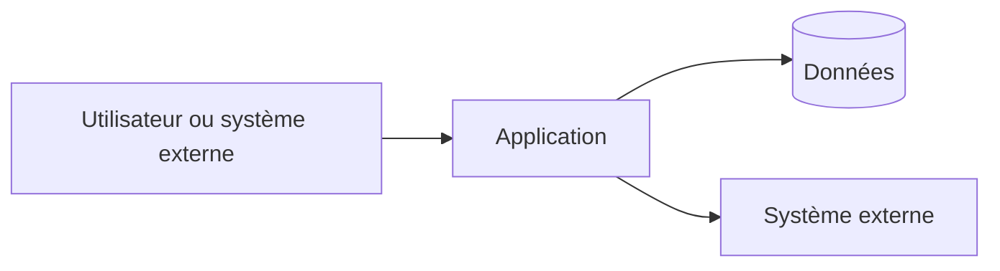

# Architecture technique

## Décisions et contraintes structurantes

Non applicable pour ce dépôt : le kit distribue des fichiers de gouvernance, sans produit applicatif.

## Composants et responsabilités

| Composant | Responsabilité | Entrées | Sorties | Dépendances | Observabilité |
| --- | --- | --- | --- | --- | --- |
| Non applicable pour ce dépôt : le kit distribue des fichiers de gouvernance, sans produit applicatif. | Non applicable pour ce dépôt : le kit distribue des fichiers de gouvernance, sans produit applicatif. | Non applicable pour ce dépôt : le kit distribue des fichiers de gouvernance, sans produit applicatif. | Non applicable pour ce dépôt : le kit distribue des fichiers de gouvernance, sans produit applicatif. | Non applicable pour ce dépôt : le kit distribue des fichiers de gouvernance, sans produit applicatif. | Non applicable pour ce dépôt : le kit distribue des fichiers de gouvernance, sans produit applicatif. |

## Diagramme de contexte et conteneurs

Non applicable pour ce dépôt : le kit distribue des fichiers de gouvernance, sans produit applicatif.

## Flux critiques et résilience

Non applicable pour ce dépôt : le kit distribue des fichiers de gouvernance, sans produit applicatif.

## Qualité technique

Non applicable pour ce dépôt : le kit distribue des fichiers de gouvernance, sans produit applicatif.
