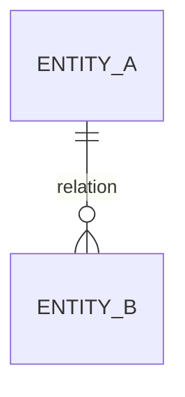

# Modèle de données

## Classification et cycle de vie

| Donnée ou entité | Sensibilité | Source | Usage | Rétention | Suppression | Responsable |
| --- | --- | --- | --- | --- | --- | --- |
| Non applicable pour ce dépôt : le kit distribue des fichiers de gouvernance, sans produit applicatif. | Non applicable pour ce dépôt : le kit distribue des fichiers de gouvernance, sans produit applicatif. | Non applicable pour ce dépôt : le kit distribue des fichiers de gouvernance, sans produit applicatif. | Non applicable pour ce dépôt : le kit distribue des fichiers de gouvernance, sans produit applicatif. | Non applicable pour ce dépôt : le kit distribue des fichiers de gouvernance, sans produit applicatif. | Non applicable pour ce dépôt : le kit distribue des fichiers de gouvernance, sans produit applicatif. | Non applicable pour ce dépôt : le kit distribue des fichiers de gouvernance, sans produit applicatif. |

## Entités, attributs et règles

| Entité | Attributs clés | Identifiant | Relations | Contraintes et invariants |
| --- | --- | --- | --- | --- |
| Non applicable pour ce dépôt : le kit distribue des fichiers de gouvernance, sans produit applicatif. | Non applicable pour ce dépôt : le kit distribue des fichiers de gouvernance, sans produit applicatif. | Non applicable pour ce dépôt : le kit distribue des fichiers de gouvernance, sans produit applicatif. | Non applicable pour ce dépôt : le kit distribue des fichiers de gouvernance, sans produit applicatif. | Non applicable pour ce dépôt : le kit distribue des fichiers de gouvernance, sans produit applicatif. |

## Diagramme de données

Non applicable pour ce dépôt : le kit distribue des fichiers de gouvernance, sans produit applicatif.

## Migrations, intégrité et sauvegarde

Non applicable pour ce dépôt : le kit distribue des fichiers de gouvernance, sans produit applicatif.
