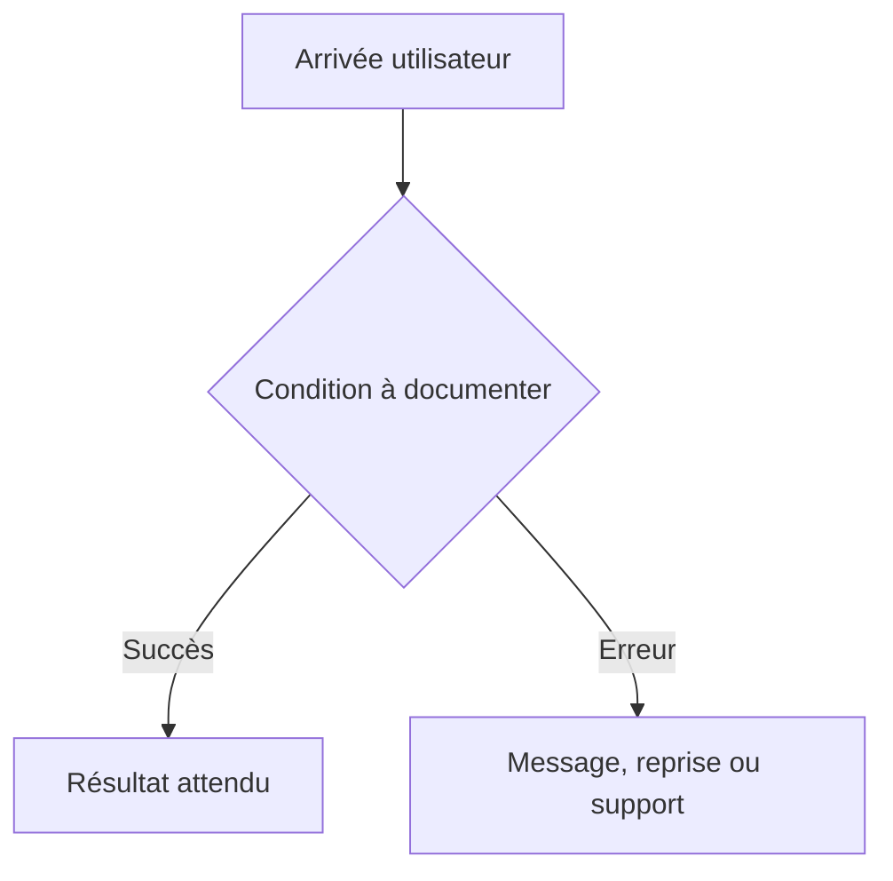

# Parcours utilisateur

## Inventaire des parcours

| ID | Déclencheur | Acteur | Résultat attendu | Échecs et reprises | Stories liées |
| --- | --- | --- | --- | --- | --- |
| FLOW-001 | Non applicable pour ce dépôt : le kit distribue des fichiers de gouvernance, sans produit applicatif. | Non applicable pour ce dépôt : le kit distribue des fichiers de gouvernance, sans produit applicatif. | Non applicable pour ce dépôt : le kit distribue des fichiers de gouvernance, sans produit applicatif. | Non applicable pour ce dépôt : le kit distribue des fichiers de gouvernance, sans produit applicatif. | Non applicable pour ce dépôt : le kit distribue des fichiers de gouvernance, sans produit applicatif. |

## Diagramme des parcours critiques

Non applicable pour ce dépôt : le kit distribue des fichiers de gouvernance, sans produit applicatif.

## Détails par parcours

### FLOW-001

- Préconditions : Non applicable pour ce dépôt : le kit distribue des fichiers de gouvernance, sans produit applicatif.
- Étapes nominales : Non applicable pour ce dépôt : le kit distribue des fichiers de gouvernance, sans produit applicatif.
- Validations et erreurs : Non applicable pour ce dépôt : le kit distribue des fichiers de gouvernance, sans produit applicatif.
- Annulation, reprise et persistance : Non applicable pour ce dépôt : le kit distribue des fichiers de gouvernance, sans produit applicatif.
- Critères de sortie : Non applicable pour ce dépôt : le kit distribue des fichiers de gouvernance, sans produit applicatif.
